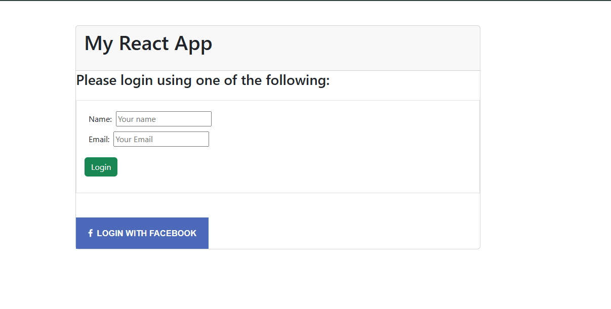

# React Facebook Login App

##  Overview

This project demonstrates how to integrate **Facebook OAuth Login** into a React application using the `react-facebook-login` library. The app allows users to log in with Facebook and displays their basic profile information after successful authentication.

---

## Features

* Facebook Login integration
* Secure authentication using OAuth
* Displays user name, email, and profile picture
* Conditional rendering (Login screen → Home screen)

---

##  Technologies Used

* React.js
* Bootstrap / React-Bootstrap
* Facebook Developer API
* OAuth 2.0

---

##  Setup Steps

1. Created a Facebook Developer App
2. Generated App ID
3. Created React app using:

   ```bash
   npx create-react-app react-fb_login
   ```
4. Installed dependencies:

   ```bash
   npm install react-facebook-login react-bootstrap bootstrap
   ```
5. Enabled HTTPS for secure login
6. Integrated Facebook Login button
7. Configured redirect URL in Facebook Developer Dashboard

---

## Important Fixes

* Removed deprecated permission `user_friends`
* Fixed invalid scope error
* Corrected import typo (`react-bootstrap`)
* Configured valid OAuth redirect URI

---

##  Run the App

```bash
npm install
npm start
```

---

## App Flow

* User opens app
* Clicks **Login with Facebook**
* Authenticates via Facebook
* Redirected back to app
* Profile info displayed

---

# Output




